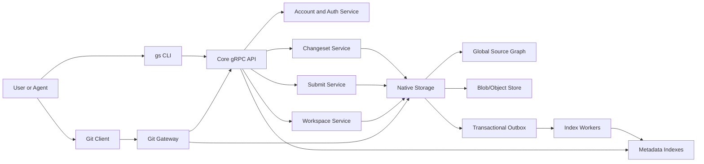

# Gitslice Architecture Design

## 1. Overview

Gitslice, or GS, is a cloud-native, Git-compatible version control system for
large multi-account codebases, repository-like slices, virtual workspaces, and
changeset-based collaboration.

The central architectural idea is:

```text
Native global source graph first.
Git compatibility at the boundary.
```

Gitslice should not be implemented internally as a traditional Git server. Git
clients should see ordinary Git repositories, but the source of truth should be
a scalable native storage and metadata system. For the MVP, that storage stack
is PostgreSQL for metadata and operational indexes, plus prototype
filesystem-based object storage for immutable blob bytes and large derived
artifacts.

Companion documents:

- [00_product.md](00_product.md): product overview, users, workflows, and scope
- [02_storage.md](02_storage.md): storage stack, Postgres schema, filesystem object layout, refs, hashing, and replication
- [03_core_api.md](03_core_api.md): gRPC services, proto messages, and gateway behavior
- [04_cli_design.md](04_cli_design.md): native `gs` CLI and workspace behavior
- [05_git_compatibility.md](05_git_compatibility.md): Git gateway, projected refs, synthetic commits, and push behavior
- [06_indexing.md](06_indexing.md): derived indexes, events, freshness, and rebuilds
- [07_conflict_resolution.md](07_conflict_resolution.md): per-path conflict detection and batched submit
- [08_mvp_implementation.md](08_mvp_implementation.md): Go MVP implementation shape and test harness
- [09_execution_plan.md](09_execution_plan.md): implementation phases and workflow validation

Gitslice is designed to support:

- Account namespaces for users and organizations
- Repository-like slices with their own visibility and access rules
- A single global commit graph across all slices
- Single-slice changesets as the only submission unit
- Sparse, virtualized workspaces
- Changesets as the review and submission unit
- Git clone, fetch, and push compatibility
- Agent-native code workflows
- Large file trees, large histories, and incremental indexing

### 1.1 System Context Diagram



The CLI and Git gateway are product entry points. The native source graph,
storage, submit validation, and indexes remain server-side product
infrastructure. Git compatibility is important, but it is not the internal
storage model.

---

## 2. Design Principles

### 2.1 Accounts Own Top-Level Namespaces

The global namespace is rooted directly under globally unique account slugs:

```text
/{account}/...
```

An account may be a user or an organization, but that type is account metadata,
not part of the path. Account slugs must be globally unique across users and
organizations.

There are no special top-level `/shared`, `/system`, or `/build` namespaces.
Shared libraries, build configuration, generated code, and platform-owned code
should live in a normal account namespace.

### 2.2 Slices Are Repository-Like

A slice is the primary unit of access, visibility, checkout, review, and Git
compatibility.

A slice is similar to a GitHub repository:

- It has an account owner.
- It has a stable slug.
- It has visibility settings.
- It has members and roles.
- It has one or more included absolute paths.
- It can be cloned as a Git repository.

A slice is not an independent storage repository internally. It is a projection
over the global commit graph.

### 2.3 Absolute Paths Everywhere

Every file and directory has one canonical absolute global path.

Example:

```text
/nicholas/services/identity/auth.go
/acme/payment/api/handler.go
```

Slices do not remap paths to custom mount locations. A checkout of a slice
preserves the canonical path layout, minus the leading `/` required by local
filesystems.

Example slice includes:

```text
/nicholas/services/identity
/nicholas/libs/auth
```

Example checkout layout:

```text
identity/
  nicholas/
    services/
      identity/
    libs/
      auth/
```

This removes path aliasing from the core model and keeps Git projection,
authorization, diffs, review, and local workspaces easier to reason about.

### 2.4 Changesets Are The Write Model

Users and agents should not normally write commits directly.

The normal write path is:

```text
workspace diff
  -> patchset
  -> changeset
  -> review and validation
  -> direct submit validation
  -> global commit or commits
  -> atomic ref update
```

Storage-level commit creation is an internal implementation detail.

### 2.5 Commits Are Storage Artifacts

Commits are immutable storage-level snapshots of the global tree.

Users interact mostly with:

- slices
- workspaces
- changesets
- patchsets
- reviews
- submit requirements

### 2.6 Git Is A Compatibility Layer

Git should be supported for clone, fetch, push, CI, IDEs, and ecosystem tools.

Git should not define the native data model.

---

## 3. Global Namespace

The repository is one global path namespace under account slugs.

```text
/nicholas/...
/alice/...
/acme/...
/open-source-lab/...
```

Examples:

```text
/nicholas/services/identity
/nicholas/libs/auth
/acme/payment
/acme/proto/payment
/acme/build/bazel
```

The global namespace allows:

- Unified history
- Global indexing
- Overlap visibility without multi-slice changesets
- Consistent absolute paths for humans, agents, APIs, and Git projections

### 3.1 Account Identity

Account identity includes a stable account id, globally unique slug, and account
kind.

```text
acct_01J...
slug: nicholas
kind: user

acct_01K...
slug: acme
kind: org
```

User and organization slugs may not overlap. Removing typed path prefixes keeps
paths shorter, but it requires a single global slug registry.

Examples:

```text
/acme
```

This path belongs to exactly one account, even if `acme` could otherwise be a
reasonable user or organization name.

### 3.2 Path Ownership

By default:

```text
/{account}/... belongs to account {account}
```

Reserved top-level names such as `.gitslice`, `shared`, `system`, and `build`
cannot be account slugs unless explicitly allowed by a future compatibility
rule.

A slice owned by an account may include paths from that same account.
For personal accounts, the default slice is `{username}/home`. Its slice slug is
`home`, and its included path is the user's account root:

```text
nic/home -> /nic
```

Personal custom slices may use other slice slugs, but their included paths must
remain under the same personal account root. For example, `nic/tools` may cover
`/nic/tools`, but it must not cover `/alice` or `/acme`.

Cross-account and cross-slice changes are not represented as a single
changeset. If a product workflow requires work in multiple slices or accounts,
that coordination happens outside the changeset model as separate, unlinked
changesets. A slice must not silently mount another account's paths.

Future explicit cross-account collaboration can be added, but it must be modeled
as explicit authorization and import/export behavior, not as a special namespace
or a cross-account changeset.

---

## 4. Slice Model

A slice is a named, repository-like projection over one or more absolute paths
inside one account namespace.

### 4.1 Slice Identity

Slice identity includes account slug and slice slug.

```text
{account}/{slice}
```

Examples:

```text
nic/home
nic/tools
nicholas/identity
acme/payment
```

This identity is used in:

- CLI commands
- API requests
- access control
- changesets
- Git URLs
- projection cache keys
- audit logs

The slice slug is the short, URL-safe name after the account slug. The slug
`home` is reserved as the default personal slice slug. Organization and custom
personal slices should use explicit product or project names such as `payment`,
`backend`, `tools`, or `dotfiles`.

### 4.2 Slice Definition

A slice definition is first-class metadata, not an ordinary source file.

Example:

```yaml
id: slc_01J...
account: nicholas
slug: identity
display_name: Identity
default_branch: main
visibility: private

included_paths:
  - /nicholas/services/identity
  - /nicholas/libs/auth
  - /nicholas/proto/identity

roles:
  admins:
    - nicholas
  writers: []
  readers: []
```

The slice definition is versioned and auditable. Each accepted definition change
creates a new slice definition version.

```text
slice_id
slice_definition_version
slice_definition_hash
created_by
created_at
included_paths
visibility
roles
metadata
```

Definition changes are control-plane changes. They should require slice admin
permission and should be recorded with the same review/audit rigor as source
changes. For protected slices, changing `included_paths`, visibility, or roles
should go through a changeset or an equivalent reviewed administrative flow.

### 4.3 Included Paths

`included_paths` are absolute global paths.

They may point to directories or individual files.

```yaml
included_paths:
  - /acme/payment
  - /acme/proto/payment
  - /acme/README.md
```

The default personal home slice uses the account root, not a nested
`/{account}/home` directory:

```yaml
account: nic
slug: home
included_paths:
  - /nic
```

Custom personal slices are narrower views inside that account root:

```yaml
account: nic
slug: tools
included_paths:
  - /nic/tools
```

There are no mount aliases.

The slice checkout and Git projection preserve the absolute path structure
inside the local repository root.

### 4.4 No Per-Directory Policy Files

The initial design does not support per-directory policy files such as
`{folder}/.gitslice/policy.yaml`.

This keeps the MVP authorization model small:

- slice visibility controls who can read a projection
- slice roles control who can create changesets from that slice
- slice submit settings control required checks and required approvals
- optional path locks cover rare high-risk paths such as large binaries or
  release manifests

Submit requirements are part of the slice definition:

```yaml
submit:
  required_approvals:
    - team: payment-owners
  required_checks:
    - payment-ci
```

Slice-definition changes that remove required checks or approvals must be
validated through the same protected administrative or reviewed changeset flow
as included-path, visibility, or role changes.

### 4.5 Overlapping Slices

Overlapping slices are supported.

A global path may be included by multiple slices. Each slice gets its own
repository-like projection over the same underlying global objects.

Example:

```yaml
# acme/backend
included_paths:
  - /acme/services
  - /acme/libs

# acme/payment
included_paths:
  - /acme/services/payment
  - /acme/proto/payment
```

In this example, `/acme/services/payment` is covered by both `acme/backend` and
`acme/payment`.

### 4.6 Covering Slices

A covering slice is any slice whose latest accepted `included_paths` contain a
path.

```text
covering_slices(path, definition_epoch)
  -> []slice_id
```

For existing files, coverage is resolved against the file path.

For new files, coverage is resolved against the path that would exist after the
change. A new file is valid only if at least one writable slice covers the new
path.

For renames and moves, coverage is resolved for both the old path and the new
path.

There is no single authoritative governing slice for an overlapping path. The
write authority for a path starts with the authoring slice and is constrained by
that slice's submit settings, required checks, and any active path locks.

The slice through which a user starts work is the authoring slice. It is useful
for UI, defaults, and Git URL resolution, but it does not weaken submit or
review requirements for the changed paths.

### 4.7 Overlap Authorization Rule

When a single-slice changeset touches paths that are also covered by overlapping
slices, the server recomputes covering slices and submit requirements.

```text
changed paths
  -> authoring slice containment
  -> covering slices
  -> submit requirements from the authoring slice definition
  -> required approvals, checks, and locks
```

The safe default is:

```text
The authoring slice must include every changed path.
Every changed path must be readable by the author.
The authoring slice submit settings provide required approvals and checks.
Path locks may add owner approval for rare high-risk paths.
```

Example:

```text
change:
  /acme/services/payment/handler.go

covering slices:
  acme/backend
  acme/payment

submit requirements:
  payment-ci
  payment-owner approval
```

### 4.8 Slice Definition Overlap Changes

Adding, removing, or moving an included path can change the covering slice set
for many files.

Definition changes that affect overlap must:

- require slice admin permission
- be audited as a new slice definition version
- recompute coverage for affected paths
- refresh validation for affected open changesets
- revalidate open changesets touching affected paths
- invalidate affected projection caches

If a slice definition change adds a new covering slice to an open changeset,
the changeset must refresh its coverage snapshot and affected projection
metadata. Submit requirements change only when the authoring slice submit
settings or active path locks change.

If a slice definition change removes a covering slice, future projection
invalidation for that slice is no longer needed. Historical coverage records are
preserved for auditability.

### 4.9 Slice History Projection

Slice history is a projection of the global commit graph using the latest
accepted slice definition by default.

That means:

```text
slice history = global commits that touched the current included_paths
```

If the slice definition changes, the default projected history can change.

Example:

```text
definition v1 includes:
  /acme/payment

definition v2 includes:
  /acme/payment
  /acme/proto/payment
```

After v2 is accepted, the default slice history includes past global commits
that touched either path.

This is intentional. The slice answers the question:

```text
What is the history of the paths this slice currently includes?
```

For audit and debugging, the system may also support pinned historical
projection:

```text
slice_id + slice_definition_version + global_commit
```

But the normal user-facing history should use the latest definition.

This has an important consequence: slice definition changes can reshape projected
history. The global commit graph remains immutable and linear, but the projected
history for a slice can gain or lose historical commits when `included_paths`
changes.

Git clients must treat a slice definition change as a projection epoch change.
The system should expose the current projection epoch in clone/fetch metadata and
surface a clear sync/reset flow if the projected Git branch is no longer a
fast-forward update for an existing checkout.

### 4.10 Projection Cache Identity

Because slice projection depends on the slice definition, projection caches must
include the definition hash.

```text
(slice_id, slice_definition_hash, global_commit_id) -> projected_tree_id
(slice_id, slice_definition_hash, global_commit_id) -> synthetic_git_commit_id
synthetic_git_commit_id -> global_commit_id
```

When a slice definition changes, the system can invalidate or lazily rebuild
projection cache entries for that slice.

---

## 5. Visibility And Access Control

Visibility and access control are slice-level.

A slice is the unit users reason about, similar to a repository on GitHub.

### 5.1 Visibility

Recommended visibility states:

```text
private
account
public
```

Meaning:

```text
private: visible only to explicitly authorized users and groups
account: visible to members of the owning account
public: readable without authentication
```

### 5.2 Roles

Recommended slice roles:

```text
owner
admin
writer
reader
```

Capabilities:

```text
owner:
  transfer/delete slice
  manage admins
  manage all settings

admin:
  manage visibility
  manage readers/writers
  change included paths
  approve protected changes

writer:
  create changesets
  push to changeset refs
  submit when server-side validation passes

reader:
  clone/fetch/read slice contents
  view changesets
```

### 5.3 Included Path Authorization

Changing `included_paths` is a privileged slice administration action.

Validation rules:

- A slice may include only paths under its owning account root: `/{account}/...`.
- Included paths may overlap other slices in the same account.
- Cross-account included paths are not allowed in the initial design.
- Public visibility cannot expose paths that account policy marks as
  non-publicable.

### 5.4 Changeset Authorization

A changeset is scoped to exactly one authoring slice. Every changed path must be
included in that authoring slice. A changeset cannot directly span multiple
slices or accounts.

For each changed global path, the server resolves all covering slices. This is
still necessary because slices can overlap. Overlap can affect visibility,
projection invalidation, and conflict reporting, but it does not make the
changeset a cross-slice changeset.

```text
changed paths
  -> authoring slice containment
  -> covering slices
  -> authoring slice submit requirements
  -> active path locks
  -> required approvals
  -> required checks
```

Cross-slice changesets are not allowed. Work that logically spans slices must be
split into separate independent changesets, each scoped to its own authoring
slice. The server must reject any patchset whose file edits are not fully
contained by the authoring slice. Gitslice does not provide a linked-changeset
object, multi-slice changeset object, or atomic coordination layer.

Cross-account changesets are not allowed in the initial design.

Default write authorization:

- A user may create a changeset from a slice where they have writer access.
- The user must have read access to every path they modify.
- Other covering slices do not add writer-role, reviewer, or approval
  requirements.
- Submission requires all submit requirements, checks, and path locks to be
  satisfied.

### 5.5 Overlap Read Visibility

Read access is evaluated through the slice being read.

If a public slice includes a path, that path is publicly readable through that
slice. A private overlapping slice cannot make the same underlying bytes private
again.

Effective exposure for a global path is therefore the broadest visibility of any
covering slice.

```text
private + public overlap -> path is public through the public slice
```

For that reason, changing a slice to `public` must analyze every included path
and surface any overlapping slices before the visibility change is accepted.

Changeset and review UIs should filter or redact file content per reader. A user
who can read only one affected slice may see the paths and diffs they are
authorized for, while hidden paths remain redacted unless the user can read the
other affected slices.

---

## 6. Workspace Model

A workspace is a local hydrated development environment bound to exactly one
slice.

Workspaces are sparse and virtualized. Users should not need to clone the entire
global namespace.

Example:

```bash
gs workspace init acme/payment
```

Example workspace layout:

```text
workspace/
  acme/
    payment/
  .gs/
```

The client maintains:

```text
workspace config
slice binding
metadata cache
hydrated file cache
overlay changes
changeset state
local operation log
draft patchset snapshots
```

Files are hydrated on demand.

The workspace has one bound slice, and every hydrated file path maps to one
canonical absolute global path. To work in another slice, the user creates a
separate workspace rooted in another directory.

The detailed native CLI and local workspace behavior is defined in
[04_cli_design.md](04_cli_design.md).

---

## 7. Changeset Model

A changeset is the collaboration and submission object.

A changeset represents a proposed change to the global source graph through one
authoring slice. It cannot directly span multiple slices or accounts. The model
has no field for secondary slices and no server-side relationship that links
multiple changesets into one submission.

### 7.1 Changeset Structure

```text
Changeset:
  id
  author
  authoring_slice
  created_at
  updated_at
  target_ref
  base_commit
  patchsets[]
  current_patchset
  affected_paths[]
  covering_slices_by_path[]
  expected_slice_definition_hashes[]
  submit_requirements
  status
  review_state
  test_state
  metadata
```

### 7.2 Patchsets

A patchset is one immutable revision of the file changes inside a changeset.
The changeset is the long-lived review and workflow object; patchsets are the
successive versions of the proposed diff.

```text
CS123
  patchset 1: initial diff
  patchset 2: updated after review feedback
  patchset 3: rebased onto a newer target ref
```

Each user or agent update to a changeset creates a new patchset instead of
mutating the previous one. This gives reviews, approvals, checks, conflict
analysis, and audit logs a stable object to refer to.

A patchset is not a Git commit and is not only a textual `.patch` file. It is a
native representation of a proposed tree change:

```text
Patchset:
  id
  changeset_id
  number
  base_commit
  created_at
  author
  changed_paths[]
  file_edits[]
  path_base_predicates[]
  read_set[]
  write_set[]
  resulting_tree_preview
  covering_slices_by_path[]
  expected_slice_definition_hashes[]
  submit_requirements_snapshot
```

Patchsets store changes using canonical global paths. They do not depend on a
mount alias or local checkout layout.

```text
/acme/payment/api/handler.go
/acme/proto/payment/payment.proto
```

The current patchset is the version that would be submitted if the changeset
lands. Older patchsets remain available for review history, auditability, and
comparison.

Approvals and checks should record which patchset they evaluated. When a new
patchset changes affected paths, covering slices, submit requirements, or file
content, the server may invalidate or refresh approvals and checks according to
submit settings.

### 7.3 Changeset Lifecycle

```text
Draft
  -> Review
  -> Submitting
  -> Submitted
```

Other states:

```text
Abandoned
Failed
MergeConflict
NeedsRebase
NeedsRequirementRefresh
```

### 7.4 Changeset To Commit Mapping

A changeset is not necessarily equal to a single commit.

Possible mappings:

```text
1 changeset -> 1 global commit
1 changeset -> N global commits
N changesets -> 1 squashed global commit
```

The user-facing object remains the changeset.

A changeset does not coordinate file edits across independent slices. The
atomicity boundary is the metadata transaction for one accepted patchset or
compatible batch on a single target ref. Work that spans slices or accounts must
be split before submission; each resulting changeset submits under exactly one
authoring slice.

### 7.5 No Direct User Commits

The public API should not expose a generic "create commit" operation as the
normal write path.

Allowed user write paths:

```text
create changeset
update changeset
submit changeset
abandon changeset
```

Internal services may create commits only as part of submit, import, migration,
or trusted administrative workflows.

---

## 8. Storage, Commits, And Refs

Commits are immutable storage-level snapshots of the global tree. Refs are
mutable named pointers to commits and move only through conditional atomic
updates.

Detailed storage, object, path hashing, ref, and replication design lives in
[02_storage.md](02_storage.md).

The architectural summary is:

```text
Ref -> Commit -> RootTree -> TreeEntries -> Blobs
```

Everything except refs is immutable. Submit workers publish accepted changes by
creating commits and moving a target ref with CAS.

---

## 9. Git Compatibility

Git compatibility is implemented as a projection layer. Each slice can be exposed
as a Git repository, but Git is not the native storage model.

The detailed Git gateway design lives in
[05_git_compatibility.md](05_git_compatibility.md).

The architectural summary is:

- clone and fetch project native commits and trees into Git objects
- Git refs are compatibility views over native refs
- Git commits are synthetic and stable for the same projection inputs
- protected pushes create or update changesets instead of directly moving
  accepted refs
- Git-originated writes must satisfy the same slice and validation rules
  as native writes

---

## 10. Core API

Native APIs are gRPC-first. HTTP endpoints should be exposed through
grpc-gateway bindings where needed.

The detailed gRPC service and message definitions live in [03_core_api.md](03_core_api.md).

The architectural summary is:

- reads resolve commits, paths, directory entries, and file streams
- writes are changeset-oriented for normal users and agents
- blob upload is staged before submit
- direct commit creation is internal and must not bypass validation
- Git compatibility is implemented by a gateway that translates Git operations
  into core API calls

---

## 11. Conflict Prevention

Gitslice should use optimistic concurrency control by default.

Every changeset has a review base commit, and every patchset records per-path
base predicates for conflict detection. Exact entry fingerprints are one
predicate type; existence and directory-presence checks are also valid
predicate types.

```text
Changeset:
  base_commit = G100

Patchset path base:
  /acme/payment/api/handler.go
  base_commit = G100
  check = exact_entry
  content_hash = h123
  mode = 100644
```

Before submission, the server validates:

```text
Can the patch apply cleanly to current head?
Do read-set path predicates still match current head?
Do affected paths still have the expected covering slices?
Does the author still have the required role in the authoring slice?
Do submit requirements pass?
Do required checks pass on the latest head?
```

### 11.1 Conflict Types

File content conflict:

```text
Two changes edit the same lines.
```

Path conflict:

```text
One changeset deletes or renames a file while another edits it.
```

Slice coverage conflict:

```text
The covering slice set or included path set changed while the changeset was open.
```

Submit requirement refresh:

```text
The authoring slice submit settings or active path locks changed while the
changeset was open.
```

Semantic conflict:

```text
Two changes touch different files but break behavior together.
```

Semantic conflicts are handled by tests and required checks.

Detailed conflict classes, path predicates, read sets, write sets, and batched
submit behavior are defined in
[07_conflict_resolution.md](07_conflict_resolution.md).

### 11.2 Overlap Conflict Resolution Process

Overlapping slices are resolved by recomputing coverage and submit requirements at
every important transition.

Process:

```text
1. Create or update patchset.
2. Normalize changed paths to canonical absolute paths.
3. Verify every changed path is included in the authoring slice.
4. Resolve covering slices for each changed path using latest slice definitions.
5. Resolve submit requirements from the authoring slice definition and path locks.
6. Store covering_slices_by_path, slice definition hashes, path base
   predicates, read/write sets, and submit requirements on the patchset.
7. Compute required approvals, locks, and checks.
8. Notify required reviewers from the authoring slice and active path locks.
9. Collect approvals required by submit settings and path locks.
10. Before submit, recompute coverage and submit requirements against latest definitions.
11. Verify read-set predicates against the latest target-ref head.
12. If coverage, submit requirements, or path predicates fail, refresh or
    rebase before continuing.
13. Reapply patch to latest target ref.
14. Run required checks.
15. Publish commit and update target ref with CAS.
```

Coverage refresh outcomes:

```text
unchanged:
  keep current requirements and continue

covering slice added:
  refresh coverage snapshot and affected projection metadata

covering slice removed:
  refresh coverage snapshot and preserve historical coverage metadata

authoring slice submit settings changed:
  recompute requirements; stale approvals may need renewal

included path moved:
  mark NeedsRebase or NeedsRequirementRefresh depending on whether the patch still applies
```

The changeset should show coverage explicitly.

Example:

```text
/acme/services/payment/handler.go
  covering slices:
    acme/backend
    acme/payment
  authoring slice:
    acme/payment
  required:
    payment-owner approval
    payment-ci
```

### 11.3 Concurrent Overlap Changes

Two changesets from different authoring slices can edit the same overlapping
path.

They do not merge independently per slice. The server resolves every covering
slice for visibility, projection invalidation, and conflict detection. Final
submission is serialized by the target-ref landing sequencer. If the first
changeset lands, the second changeset must reapply to the new head.

If the patch no longer applies cleanly, it becomes `NeedsRebase` or
`MergeConflict`.

### 11.4 Approval Semantics

Approvals are recorded against both:

```text
authoring_slice_id
slice_definition_hash
patchset_id
```

An approval remains valid only while the relevant patchset, authoring slice
definition, and submit requirements remain valid, unless submit settings
explicitly allow stale approvals. Covering-slice changes can refresh projection
and visibility metadata, but they do not create new approval requirements.

### 11.5 Submit Requirement Refresh

Submit requirements are intentionally simple in the MVP: required approvals and
required checks compose by union with active path locks. If requirements change
while a changeset is open, the changeset cannot submit until it refreshes and
records the new requirement snapshot.

Resolution options:

```text
1. Refresh the changeset and collect newly required approvals/checks.
2. Split the changeset so high-risk paths are reviewed separately.
3. Apply an explicit admin override if the account allows overrides.
4. Abandon the changeset.
```

Admin overrides must be audited and should name the submit requirements they
override.

---

## 12. Direct Submit Validation

The MVP does not include a separate submit scheduling abstraction. A changeset
submits directly after the server proves that the current patchset satisfies
authorization, review, required checks, active path locks, and target-ref
freshness.

Submit requirements come from the authoring slice definition:

```yaml
submit:
  required_approvals:
    - team: acme-maintainers
  required_checks:
    - acme-ci
```

Those settings are versioned with the slice definition. Changing them is a
control-plane change and should go through a changeset or equivalent reviewed
administrative flow. Weakening required approvals or checks must be audited and
must not rely on the weakened settings to approve itself. A changeset that
weakens submit settings should not include ordinary source changes that depend
on the weakened requirements; split those changes so the control-plane change is
reviewed and accepted first.

### 12.1 Submit Requirement Resolution

Requirement resolution happens after changed paths and covering slices are
resolved.

```text
changed paths
  -> authoring slice containment
  -> covering slices
  -> authoring slice submit settings
  -> active path locks that intersect changed paths
  -> required approvals and checks
```

The current MVP rule is intentionally direct: the authoring slice defines submit
requirements for the whole changeset. Other covering slices affect visibility,
projection invalidation, and conflict detection, but they do not add submit or
approval requirements.

Submit requirement records:

```text
authoring_slice_id
slice_definition_hash
path_lock_set_hash
path_base_predicates
read_set
write_set
matched_path_locks
required_checks
required_approvals
```

### 12.2 Submit Flow

For a changeset:

```text
1. Load the current patchset.
2. Recompute changed paths and covering slices.
3. Recompute read/write sets and path base predicates.
4. Recompute submit requirements from the authoring slice and active path locks.
5. Verify authoring slice containment and read/write authorization.
6. Verify required approvals are fresh for the current patchset.
7. Run or verify required checks.
8. Hand off to the target-ref landing sequencer.
9. Rebase or reapply onto the latest target ref inside the sequencer lease.
10. Revalidate path predicates, submit requirements, checks, and conflicts.
11. Create final commit or commits.
12. Atomically update target ref with CAS.
13. Emit indexing events for every affected slice projection.
```

If CAS fails despite the sequencer lease, the worker treats it as a stale
sequencer/admin-intervention conflict, reloads the new head, and returns the
changeset to a retryable submit state. It should not spin in an unbounded CAS
retry loop.

### 12.3 Target-Ref Landing Sequencer

Correctness requires one final linearization point per `target_ref`.

The Submit Service owns a target-ref landing sequencer for each target ref.
Validation and checks may run concurrently. Submit admission happens through
durable path-head CAS: each changed path is compared against the patchset's
recorded base fingerprint, then advanced to the accepted post-patch
fingerprint in the same transaction that appends a `pending_publish` row.

The target-ref publisher remains responsible for making accepted work visible
through root-based reads and Git projections.

Publisher responsibilities:

- acquire a short publish window for the target ref
- reload the latest target-ref head
- load pending rows in admission sequence order
- apply accepted patchsets into a deterministic commit chain
- publish the commit chain and move the ref with CAS
- mark included changesets submitted

The publisher is not a product-level scheduling abstraction. It only batches and
serializes the final commit publication step for one target ref.

The submit service may batch multiple accepted changesets for the same target
ref. Normal same-path conflicts have already been rejected by path-head CAS. A
batch publishes a deterministic commit chain and moves the target ref once.
Batching is a throughput optimization; every included changeset still keeps its
own patchset, approval state, commit id, and audit trail.

### 12.4 Why Submit Still Needs CAS

The target-ref sequencer reduces races, but it does not remove the need for
atomic ref updates.

Two submit workers can observe stale state if a sequencer lease expires, an
admin operation moves the ref, or a worker is retried after a partial failure.
CAS ensures only one writer wins the exact head it validated against. The losing
submitter returns to a retryable state and must rerun freshness validation
before trying again.

This gives the system both:

- simple MVP submit validation
- global commit/ref correctness
- a path to scale hot target refs through safe batching

---

## 13. Optional Path Locks

Gitslice should avoid locks for normal source development.

Explicit locks may still be useful for rare high-risk paths.

Examples:

```bash
gs lock /acme/infra/prod
gs lock /acme/releases/2026-Q2.yaml
```

Use locks for:

- large binary files
- critical infrastructure config
- generated snapshots
- schema migrations
- release manifests

Path locks do not replace changesets, review, or submit validation.

---

## 14. Indexing System

Indexes are derived data and should be incremental, event-driven, and
rebuildable from source-of-truth objects.

The detailed index catalog, event pipeline, freshness model, and rebuild rules
live in [06_indexing.md](06_indexing.md).

---

## 15. Build And CI Integration

Gitslice should integrate with scalable build and CI systems.

Recommended systems:

- Bazel
- Buck2
- Pants
- ordinary CI runners for smaller slices

Required capabilities:

- affected target calculation
- remote execution where available
- remote caching where available
- test impact analysis
- hermetic builds where practical
- build graph indexing

Submission policies should be able to reference required checks.

Example:

```yaml
submit:
  required_owners:
    - identity-team

  checks:
    - //nicholas/services/identity/...
    - //nicholas/proto/identity/...
```

---

## 16. Service Architecture

Core services:

```text
Object Store
Metadata Service
Slice Service
Workspace Service
Git Gateway
GS API Gateway
Changeset Service
Submit Service
Index Service
Build/CI Service
Auth Service
Replication Service
```

### 16.1 Object Store

The prototype filesystem object store stores file contents, immutable tree-node
payloads, large binary objects, staged uploads, and large derived artifacts such
as Git projection packs. It is not the source of truth for object liveness;
Postgres commit, blob, and reachability metadata is. This storage mode is for
local prototype and test environments, not horizontally scaled production
deployment.

### 16.2 Metadata Service

PostgreSQL stores commit metadata, root tree hashes, refs, slice definitions,
changesets, object metadata, path predicates, leases, operational indexes, and
the transactional outbox. It does not store a full file snapshot for every
commit; path resolution loads tree nodes from object storage starting at the
commit's `root_tree_id`.

### 16.3 Slice Service

Manages slice definitions, slice resolution, visibility, roles, included paths,
coverage indexes, and projections.

### 16.4 Workspace Service

Provides backend helpers for workspace metadata, sparse hydration, diff
validation, and optional workspace operation records. The CLI remains
responsible for local workspace files, local cache, and local undo behavior. See
[04_cli_design.md](04_cli_design.md).

### 16.5 Git Gateway

Implements Git smart HTTP and translates between Git objects and native objects.

### 16.6 GS API Gateway

Implements the native GS protocol used by the CLI, web app, SDKs, and agents.

### 16.7 Changeset Service

Manages changesets, patchsets, review state, and workflow state.

### 16.8 Submit Service

Evaluates submit requirements, verifies approvals and checks, coordinates the
target-ref landing sequencer, and performs final validation before CAS ref
updates.

### 16.9 Index Service

Maintains changed-path, path history, slice coverage, submit requirement
provenance, build, test, and projection indexes. See
[06_indexing.md](06_indexing.md).

---

## 17. Replication Architecture

Replication requirements are part of the storage design. See
[02_storage.md](02_storage.md#8-replication-architecture).

---

## 18. System Invariants

These invariants must not be violated.

```text
1. A committed tree is immutable.
2. A committed blob is immutable and content-addressed.
3. A committed tree id is the hash of canonical tree entries.
4. A commit id is the hash of the canonical commit object.
5. A commit points to exactly one root tree, and root_tree_id is that tree's id.
6. Native commit, tree, and blob ids are not Git object ids.
7. A ref update is atomic and conditional.
8. A single target-ref submit either publishes all final commits and moves that target ref, or publishes none.
9. Submit settings are versioned with slice definitions.
10. A patchset records path base predicates, read sets, and write sets used for submit freshness checks.
11. Batched submit may move a target ref once for multiple changesets only when their read/write sets are compatible and their read-set predicates are fresh.
12. A changeset must satisfy the submit requirements of its authoring slice and any active path locks.
13. A slice projection is deterministic for a given slice id, slice definition hash, and global commit.
14. Default slice history uses the latest accepted slice definition.
15. Slice visibility and roles govern access to all paths included by the slice.
16. A global path may be covered by multiple slices.
17. Each changeset has exactly one authoring slice; multi-slice changesets are rejected.
18. Writes to overlapping paths must satisfy current submit validation at submit time.
19. Effective read exposure for a path is the broadest visibility of any covering slice.
20. Git synthetic commit IDs are stable for the same projection inputs.
21. Metadata must never reference an unverified blob.
22. Derived indexes can be rebuilt from commits, trees, blobs, slice definitions, and path lock records.
```

---

## 19. Execution Plan

MVP implementation details are in
[08_mvp_implementation.md](08_mvp_implementation.md). Implementation phases and
workflow validation are in [09_execution_plan.md](09_execution_plan.md).

---

## 20. Non-Goals For The Initial Design

The initial design should not include:

- special `/shared` or `/system` namespaces
- custom mount aliases inside slices
- direct user-facing commit creation
- single-owner path model
- object-store participation in metadata transactions
- path-level ACLs as the primary access model
- per-directory policy files
- code search in the MVP
- a separate submit scheduling abstraction in the MVP
- Git-native storage internals
- cross-slice changesets
- multi-slice workspaces
- distributed atomic commits across slices or target refs

These can be revisited only if a concrete product requirement justifies the
additional complexity.

---

## 21. Long-Term Direction

Gitslice should become a source graph platform with:

- Git-compatible slice repositories
- repository-like access control
- global-scale history and indexing
- sparse workspaces for humans and agents
- changeset-centered collaboration
- single-slice changeset submission
- native cloud storage and metadata architecture

The architecture should stay simple at the conceptual boundary:

```text
global paths
slice coverage
changesets
immutable commits
atomic refs
Git projection
```
